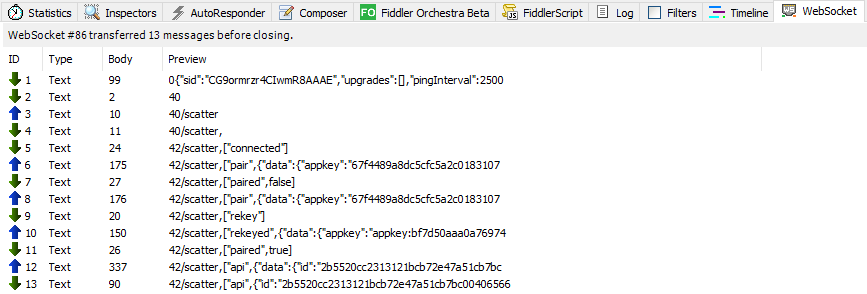

# scatter-sharp
Scatter C# library to interact with ScatterDesktop / ScatterMobile

# Clone repo

```
git clone https://github.com/GetScatter/scatter-sharp --recursive
```

### Prerequisite to build

Visual Studio 2017+ 

### Instalation
scatter-sharp is now available throught nuget https://www.nuget.org/packages/scatter-sharp
```
Install-Package scatter-sharp
```

### Usage

#### Configuration

In order to use scatter you need to create a instance with **AppName** and a **Network** configuration, connect to scatter application, request a **Identity** and then fetch a new **Eos** instance.

Example:

```csharp
var network = new Api.Network()
{
    blockchain = Scatter.Blockchains.EOSIO,
    host = "api.eossweden.se",
    port = 443,
    protocol = "https",
    chainId = "aca376f206b8fc25a6ed44dbdc66547c36c6c33e3a119ffbeaef943642f0e906"
};

var scatter = new Scatter(new ScatterConfigurator()
{
   AppName = "SCATTER-SHARP",
   Network = network,
   StorageProvider = storageProvider
});

await scatter.Connect();

var identity = await scatter.GetIdentity(new Api.IdentityRequiredFields()
{
    accounts = new List<Api.Network>()
    {
        network
    },
    location = new List<Api.LocationFields>(),
    personal = new List<Api.PersonalFields>()
});

var eos = new Eos(new EosSharp.Core.EosConfigurator() {
    ChainId = network.chainId,
    HttpEndpoint = network.GetHttpEndpoint(),
    SignProvider = new ScatterSignatureProvider(scatter)
});

var account = scatter.Identity.accounts.First();

var result = await eos.CreateTransaction(new EosSharp.Core.Api.v1.Transaction()
{
    actions = new List<EosSharp.Core.Api.v1.Action>()
    {
        new EosSharp.Core.Api.v1.Action()
        {
            account = "eosio.token",
            authorization =  new List<PermissionLevel>()
            {
                new PermissionLevel() {actor = account.name, permission = account.authority }
            },
            name = "transfer",
			//Using a dictionary with key, object works on WEBGL
            data = new Dictionary<string, object>()
            {
                { "from", account.name },
                { "to", "eosio" },
                { "quantity", "0.0001 EOS" },
                { "memo", "Unity3D hello crypto world!" }
            }
        }
    }
});

... **Use all eos api methods as usual from eos-sharp** ...

scatter.Dispose();
```

#### App Storage Provider

Scatter uses a appKey and Nonce to help pair your application with the users permissions. By default this information is stored on memory but you may want to save on disk to be reused later.

Create a new Scatter instance and configure a FileStorageProvider with the target filePath.
```csharp
var fileStorage = new FileStorageProvider(filePath);

using (var scatter = new Scatter(new ScatterConfigurator()
{
   AppName = "SCATTER-SHARP",
   Network = network,
   StorageProvider = fileStorage
})
{
    await scatter.Connect();
    ....    
}
```

#### Generic / Fiddler proxy

Is useful to configure a proxy to investigate and debug all the information that goes thru scatter-sharp <-> ScatterDesktop. Fiddler is a popular http/websocket proxy solution but you can configure any other.

##### Enabling proxy

Add a proxy object to scatter configurator that accepts Url and optionaly User and Password. Note that this is used in websocket-sharp and not the implementation for WebGL (not needed).

```csharp
var scatter = new Scatter(new ScatterConfigurator()
{
   AppName = "SCATTER-SHARP",
   Network = network,
   StorageProvider = storageProvider,
   Proxy = new Proxy()
   {
       Url = "http://127.0.0.1:8888"
   }
});
```

##### Fiddler unmask websocket traffic

On tab "FiddlerScript" add this code in the end of function "OnBeforeRequest"

```
static function OnBeforeRequest(oSession: Session) {
...
	if (oSession.RequestHeaders.ExistsAndContains ("Sec-WebSocket-Extensions", "permessage-deflate")) {
	    oSession.RequestHeaders.Remove ( "Sec-WebSocket-Extensions");
	}
}
```

##### Fiddler check websocket traffic

Double click "ws" icon to open websocket tab


In websocket tab you can view in real-time all the communication between scatter-sharp <-> ScatterDesktop



#### Scatter Api methods
- **Connect**
Connect to scatter
```csharp
await scatter.Connect();

- **GetVersion**
Gets the Scatter version
```csharp
string version = await scatter.GetVersion();
```

- **GetIdentity**
Prompts the users for an Identity if there is no permission, otherwise returns the permission without a prompt based on origin.
```csharp
Identity identity = await scatter.GetIdentity(new Api.IdentityRequiredFields() {
    accounts = new List<Api.Network>()
    {
        network
    },
    location = new List<Api.LocationFields>(),
    personal = new List<Api.PersonalFields>()
});
```
Returns:
```csharp
public class Identity
{
    public string hash;
    public string publicKey;
    public string name;
    public bool kyc;
    public List<IdentityAccount> accounts;
}
```

- **GetIdentityFromPermissions**
Checks if an Identity has permissions and return the identity based on origin.
```csharp
Identity identity = await scatter.GetIdentityFromPermissions();
```
Returns:
```csharp
public class Identity
{
    public string hash;
    public string publicKey;
    public string name;
    public bool kyc;
    public List<IdentityAccount> accounts;
}
```

- **ForgetIdentity**
Removes the identity permission for an origin from the user's Scatter, effectively logging them out.
```csharp
bool result = await scatter.ForgetIdentity();
```

- **Authenticate**
Sign origin (appName) with the Identity's private key. Or custom data with custom publicKey
```csharp
string signature = await scatter.Authenticate();
```

- **GetArbitrarySignature**
Request arbitrary data with the constraint of max 12 words
```csharp
string signature = await scatter.GetArbitrarySignature(string publicKey, string data, string whatfor = "", bool isHash = false);
```

- **GetPublicKey**
Allows apps to request that the user provide a user-selected Public Key to the app. ( ONBOARDING HELPER )
```csharp
string pubKey = await scatter.GetPublicKey(string blockchain);
```

- **LinkAccount**
Allows the app to suggest that the user link new accounts on top of public keys ( ONBOARDING HELPER )
```csharp
bool result = await scatter.LinkAccount(string publicKey);
```

- **HasAccountFor**
Allows dapps to see if a user has an account for a specific blockchain. DOES NOT PROMPT and does not return an actual account, just a boolean.
```csharp
bool result = await scatter.HasAccountFor();
```

- **SuggestNetwork**
Prompts the user to add a new network to their Scatter.
```csharp
bool result = await scatter.SuggestNetwork();
```

- **AddToken**
Add token to wallet
```csharp
bool result = await scatter.AddToken(Token token);
```

- **On**
Register listener for scatter event type
```csharp
scatter.On(string type, Action<object> callback);
```

- **Off**
Remove listeners
```csharp
scatter.Off(string type);
scatter.Off(string type, int index);
scatter.Off(Action<object> callback);
scatter.Off(string type, Action<object> callback);
```
